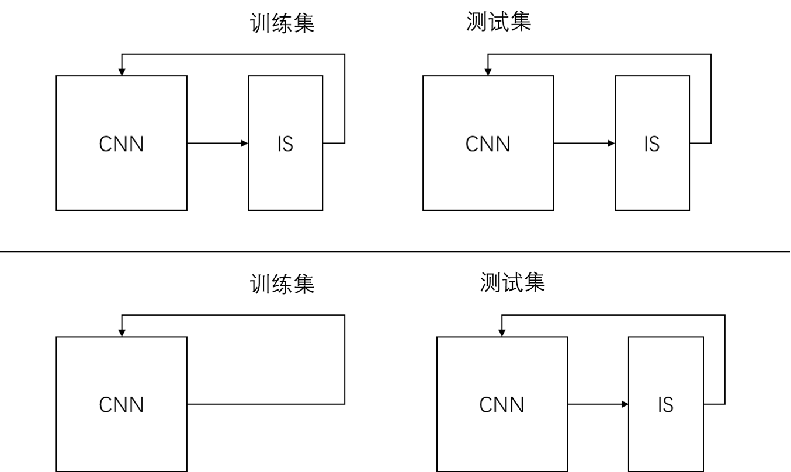

# MLEC

## dataset

| 数据集 | N | T | 训练/测试 |
| --- | --- | --- | --- |  
|`traindata500.txt`和`testdata500.txt`|16|0.5$\lambda$|500/100|
|`traindata500x.txt`和`testdata500x.txt`|16|随机|500/100|
|`traindata1000.txt`和`testdata1000.txt`|20|0.5$\lambda$|1000/200|
|`traindata10000.txt`和`testdata10000.txt`|20|0.5$\lambda$|10000/1000|
|`traindata10000_30.txt`和`testdata10000_30.txt`|30|0.5$\lambda$|10000/1000|

## 网络结构

上面的结构在训练时多了一层IS，有可能不会收敛，速度慢。
